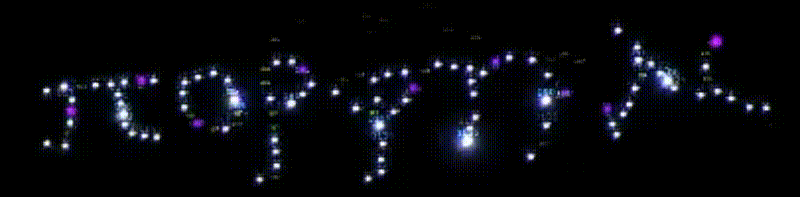

# Vesuvius First Word Badge - Hardware Design Files (for Kicad)

This repository contains the hardware design files for the Vesuvius First Word Badge badge that displays the first word found in burnt papyrus scrolls
analyzed for the [Vesuvius Challenge](https://scrollprize.substack.com/p/first-word-discovered-in-unopened).

Read more about the hardware of the badge in this [blog post](https://vesuvius.virtual-void.net/blog/2024/01/10/vesuvius-badge-hardware/). The Pico-based
firmware can be found in [vesuvius-badge-pico](https://github.com/jrudolph/vesuvius-badge-pico).

